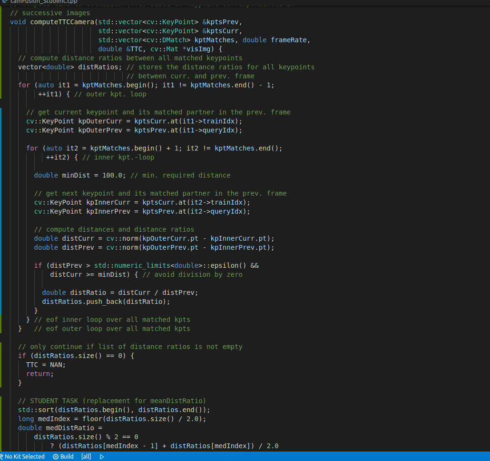

# SFND 3D Object Tracking

Welcome to the final project of the camera course. By completing all the lessons, you now have a solid understanding of keypoint detectors, descriptors, and methods to match them between successive images. Also, you know how to detect objects in an image using the YOLO deep-learning framework. And finally, you know how to associate regions in a camera image with Lidar points in 3D space. Let's take a look at our program schematic to see what we already have accomplished and what's still missing.

In this final project, you will implement the missing parts in the schematic. To do this, you will complete four major tasks: 
1. First, you will develop a way to match 3D objects over time by using keypoint correspondences. 
2. Second, you will compute the TTC based on Lidar measurements. 
3. You will then proceed to do the same using the camera, which requires to first associate keypoint matches to regions of interest and then to compute the TTC based on those matches. 
4. And lastly, you will conduct various tests with the framework. Your goal is to identify the most suitable detector/descriptor combination for TTC estimation and also to search for problems that can lead to faulty measurements by the camera or Lidar sensor. In the last course of this Nanodegree, you will learn about the Kalman filter, which is a great way to combine the two independent TTC measurements into an improved version which is much more reliable than a single sensor alone can be. But before we think about such things, let us focus on your final project in the camera course. 

## Dependencies for Running Locally
* cmake >= 2.8
  * All OSes: [click here for installation instructions](https://cmake.org/install/)
* make >= 4.1 (Linux, Mac), 3.81 (Windows)
  * Linux: make is installed by default on most Linux distros
  * Mac: [install Xcode command line tools to get make](https://developer.apple.com/xcode/features/)
  * Windows: [Click here for installation instructions](http://gnuwin32.sourceforge.net/packages/make.htm)
* Git LFS
  * Weight files are handled using [LFS](https://git-lfs.github.com/)
* OpenCV >= 4.1
  * This must be compiled from source using the `-D OPENCV_ENABLE_NONFREE=ON` cmake flag for testing the SIFT and SURF detectors.
  * The OpenCV 4.1.0 source code can be found [here](https://github.com/opencv/opencv/tree/4.1.0)
* gcc/g++ >= 5.4
  * Linux: gcc / g++ is installed by default on most Linux distros
  * Mac: same deal as make - [install Xcode command line tools](https://developer.apple.com/xcode/features/)
  * Windows: recommend using [MinGW](http://www.mingw.org/)

## Basic Build Instructions

1. Clone this repo.
2. Make a build directory in the top level project directory: `mkdir build && cd build`
3. Compile: `cmake .. && make`
4. Run it: `./3D_object_tracking`.

## Project rubic points:

1- Data Buffer :

I have used verctor Insert method to push element from back and pop first element(First Come First Serve) to optimize the data storage.

2-Keypoints detection:

the first step is to get the Key points in the input Image so we can use those key points to find matches with the following images. 
Using opencv Lib. I have Implement many key points detector (HARRIS, FAST, BRISK, ORB, AKAZE, and SIFT detectors).

By expermentaion:
* the Fast detector was the quickest in keypoint detection.
* SIFT detector was the slowest

the output from this step will be like this:

As our Interest is to get the Time to Collision so I focused on the front car by removing any key point outside the car 
box by comapring the points Indecies with car box coordenadas.

3-Descriptors:

Using opencv Lib. I have Implement many key points Descriptors (BRIEF, ORB, FREAK, AKAZE and SIFT Descriptors).
By expermentaion:
* the BRISK Descriptors was the quickest with FAST key points detector.
* SIFT detector was the slowest with FAST key points detector.

After we get the Keypoint and It's Enviroment we step the matching by using the K-nearest or Nearest neighbor.

the out from matching step will be like that:

## TEST Results:

based on the test result:
top 3 are:

1-FAST+BRISK

2-FAST+ORB	

3-FAST+BRIEF	

## FP.1 : Match 3D Objects

takes as input both the previous and the current data frames and provides as output the ids of the matched regions of interest (i.e. the boxID property)“. Matches must be the ones with the highest number of keypoint correspondences.

steps:

Loop on current bounding boxs:
find matches releated to the box
Loop on prev bounding boxs with the outindex from the above step
match poinht and assign the prev bounding box with highest number of points

## FP.2 : Compute Lidar-based TTC

 
 compute the time-to-collision for all matched 3D objects based on Lidar measurements alone.

 Steps:
 *Sort the Detection and take the value from the vector using ratio to ensure the value in the safe side 
 
 I used distance in the 10% location of the vector size.
 x[(int)x.size() * ratio]
 
 * calculte the TTC based on const velocity model

 

 ## FP.3 : Associate Keypoint Correspondences with Bounding Boxes

find all keypoint matches that belong to each 3D object. we can do this by simply checking whether the corresponding keypoints are within the region of interest in the camera image. All matches which satisfy this condition should be added to a vector. 

steps:
loop on the match points.
get the max and min distance between match points
loop on the match points.
check if the point in the region of the bounding box.
check if the point distance less than average of min max distance
add the point to the kmatch in the bounding box.

 

## FP.4 : Compute Camera-based TTC 

n (1) we use the focal length of the camera and a distance measurement d0d_0d0​ performed at time t0t_0t0​ to project the height HHH of the vehicle onto the image plane and thus to a height h0h_0h0​ in pixels. The same is done at time t1 t_1t1​, leading to a projected height h1h_1h1​.

In (2), we compute the ratio of the relative heights h0h_0h0​ and h1h_1h1​. As both HHH and fff are cancelled out, we can observe a direct relation between relative height hhh and absolute metric distance ddd. We can thus express the distance to the vehicle d0d_0d0​ as the product of d1d_1d1​ and the ratio of relative heights on the image plane.

 

## Output :

 

 ## FP.5 : Performance Evaluation 1

the Lidar-based TTC estimate is way off was when (d0 - d1) has the same value which mean the car is stopping my be because traffic jam 
the measurment thends to inf.

## Output : FP.6 : Performance Evaluation 2

based on the test result:
top 3 are:

1-FAST+BRISK

2-FAST+ORB	

3-FAST+BRIEF	

the Camera-based TTC estimate is way off was when medDistRatio is 1 which mean the car is stopping my be because traffic jam 
the measurment thends to inf.